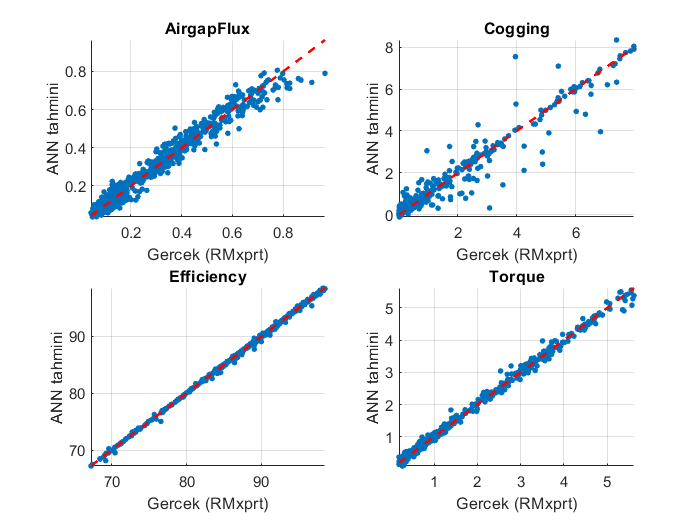
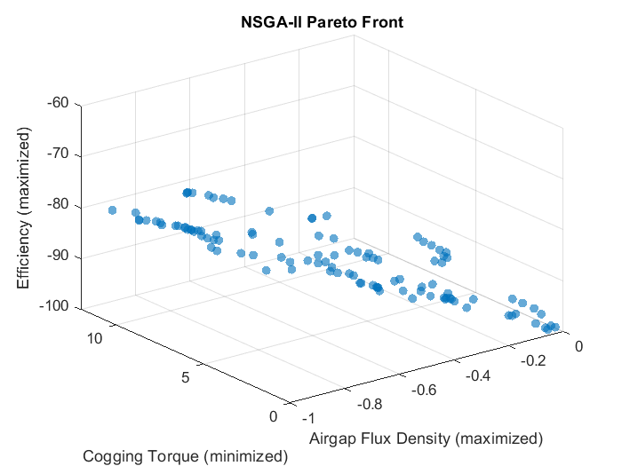
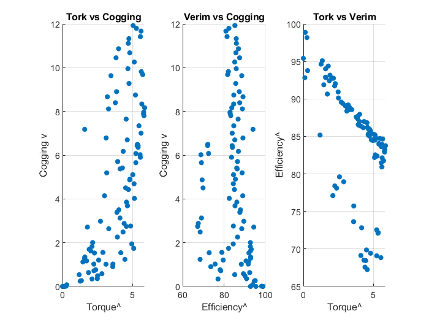

\# BLDC Motor AI Optimization


An artificial neural network (ANN) based surrogate model and NSGA-II multi-objective genetic algorithm optimization study for brushless DC (BLDC) motor design.


\# Overview


This project models the effect of electric motor design parameters (pole/slot combination, magnet thickness, embrace ratio, slot type, steel type, etc.) on motor performance outputs (flux, cogging torque, torque, efficiency) and searches for the best design through the following pipeline:


1\. Data collection — Balanced exploration of the design space using Latin Hypercube Sampling (LHS), with output data obtained from RMxprt (Ansys AEDT) simulations.

2\. Data cleaning — Removal of designs with demagnetization or physically inconsistent results from the dataset.

3\. ANN training — Training a feedforward neural network on the cleaned dataset using the Levenberg-Marquardt algorithm, producing a fast surrogate model for motor performance prediction.

4\. NSGA-II optimization — Finding Pareto-optimal design candidates using a multi-objective genetic algorithm on top of the trained ANN model.

5\. Decision-making with TOPSIS — Selecting the final design among the Pareto front candidates using multi-criteria decision analysis.


\# Folder Structure


```

├── Automation/       # Python script for analyzing simulation outputs

├── MATLAB/           # ANN training, NSGA-II, and decision-making scripts

├── Data Set/         # Processed dataset used for training

├── Results/          # Pareto results, TOPSIS ranking, validation results

```


\# Files


\- `Automation/Analiz\_Edici.py` — Python script for analyzing simulation/optimization outputs.

\- `MATLAB/ann.m` — Artificial neural network training script.

\- `MATLAB/nsga2.m` — NSGA-II multi-objective genetic algorithm optimization script.

\- `MATLAB/karar.m` — TOPSIS-based decision-making script.

\- `Data Set/ann\_veri\_onehot.csv` — Processed, one-hot encoded dataset used for ANN training.

\- `Results/pareto\_sonuclar.csv` — Pareto-optimal design results produced by NSGA-II.

\- `Results/topsis\_siralama.csv` — Design candidates ranked using TOPSIS.

\- `Results/dogrulama\_sonuc.csv` — Validation results for the selected design.

\# Results

Comparison of ANN-predicted values against actual RMxprt simulation results for all four outputs (Airgap Flux, Cogging Torque, Efficiency, Torque):



3D Pareto front showing the trade-off between airgap flux density, cogging torque, and efficiency:



Pairwise scatter plots of the Pareto-optimal designs (Torque vs Cogging, Efficiency vs Cogging, Torque vs Efficiency):



\# Note


The PyAEDT scripts used for RMxprt simulation automation have not been added to this repository yet; this repository currently covers the data analysis, ANN training, and optimization steps.


\# Requirements


\- MATLAB (Optimization Toolbox, Deep Learning Toolbox)

\- Python 3.x (basic libraries such as pandas, numpy)


\# License


This project is licensed under the MIT License. See the `LICENSE` file for details.